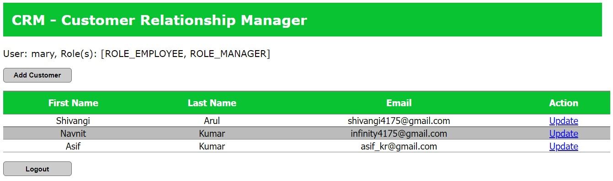

## Introduction
- This is a Customer Resource Manager based on Spring Boot. 
- This is a basic project which provides CRUD operations with the help of `Spring framework` assisted with `Spring Security`, `Hibernate` and `MySQL` . 
- This project is ROLE based, by which access to various operations related to customers are provided by the ROLES. 
- A bit of frontend using `JSP + CSS (bootstrap)` is integrated to provide looks to the project. 
- This project was made while learning from Udemy course named **Spring and Hibernate for Beginners** by **Chad Darby**. 

## Roles and Authentication Details  

| Role | Username | Password | Operations |
|------|----------|----------|------------|
| Admin| susan    | fun123 | Allowed to add, update and delete customer |
| Manager| mary | fun123| Allowed to add and update customer |
| Employee | john | fun123| Allowed to only see the list of customer |

- Any new user would be registered as Employee. 

## Tables and Relationships 
### Customer

### User and Authorities

## Operations 
### Login 

### Registration

### Page Displayed to Employee 

### Page Displayed to Manager

### Page Displayed to Admin 

### Add customer 

